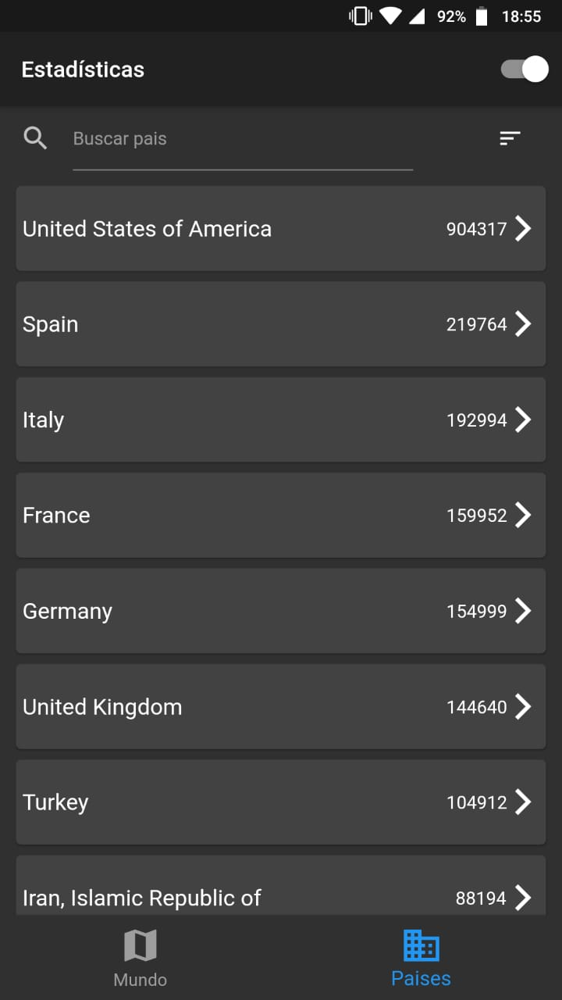

# estadisticapp

Aplicación hecha en Flutter, obteniendo los datos de la Api de Coronavirus

## Getting Started

This project is a starting point for a Flutter application.

#### Flutter App Screenshots

<table>
  <tr>
    <td>Pantalla Principal</td>
     <td>Pantalla Paises</td>
  </tr>
  <tr>
    <td></td>
    <td></td>
  </tr>
 </table>
